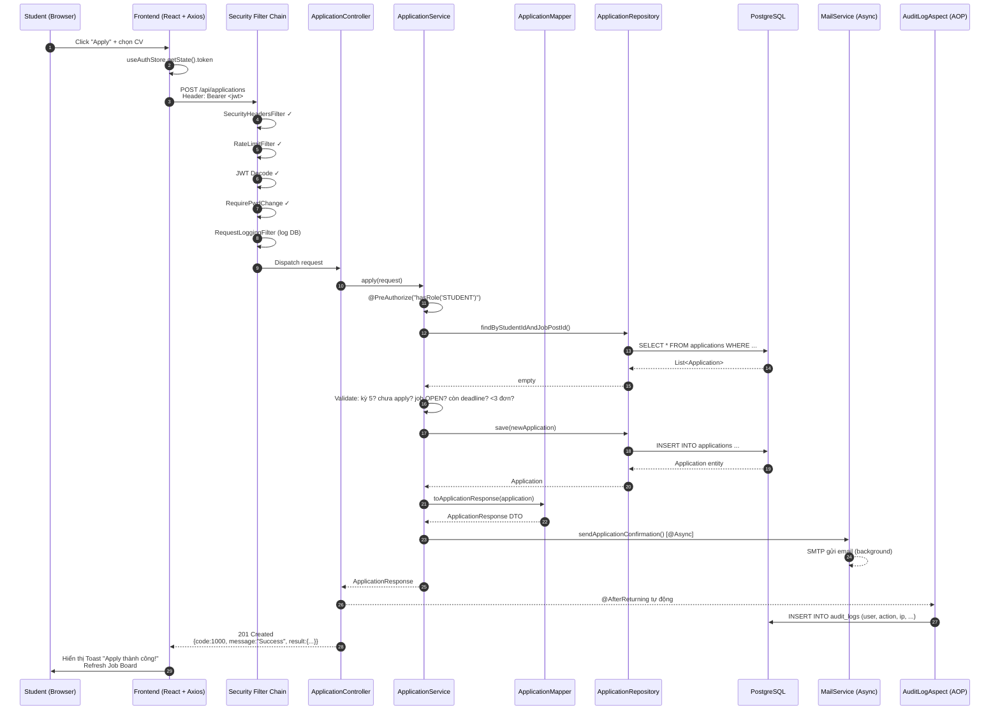
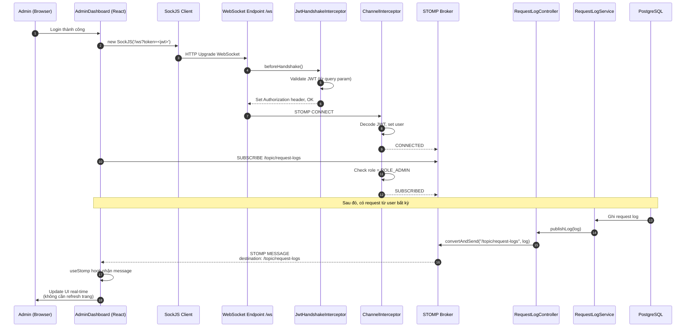
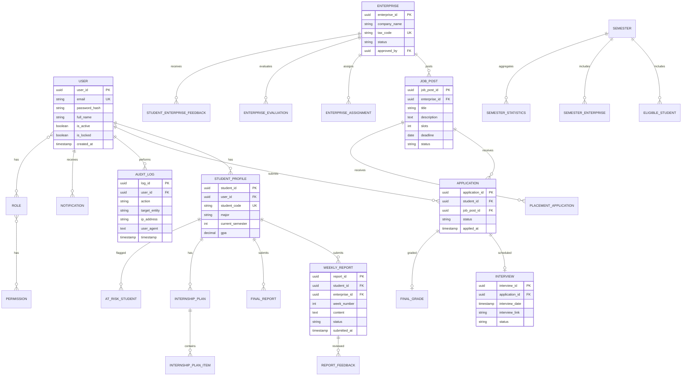
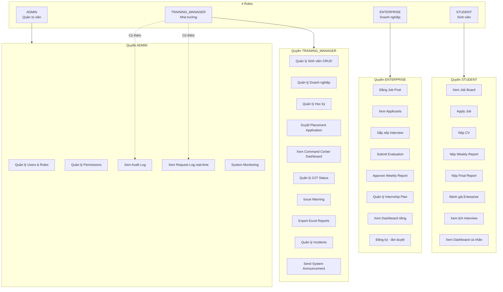
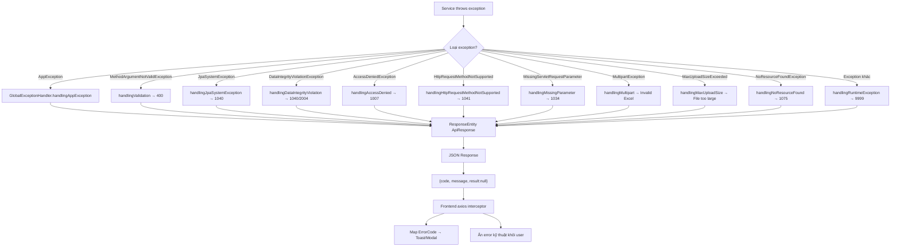
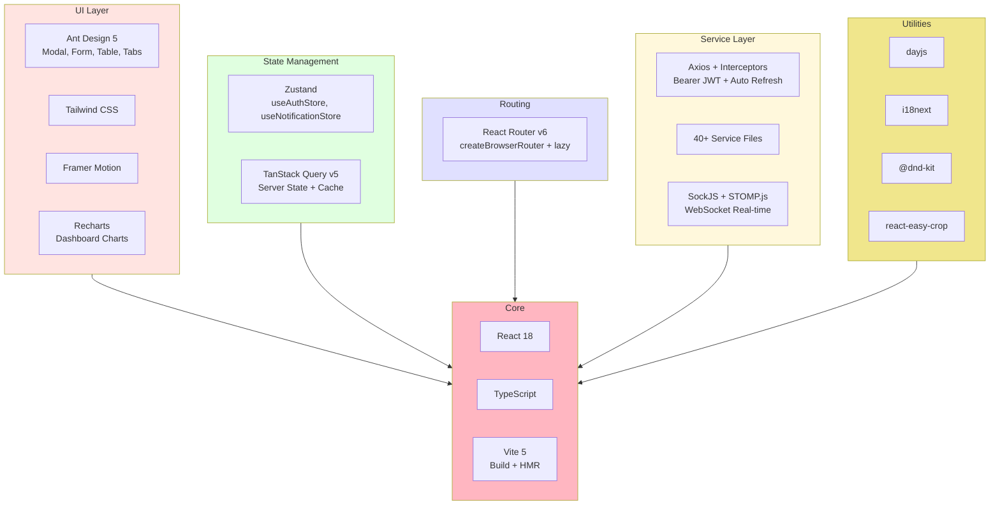
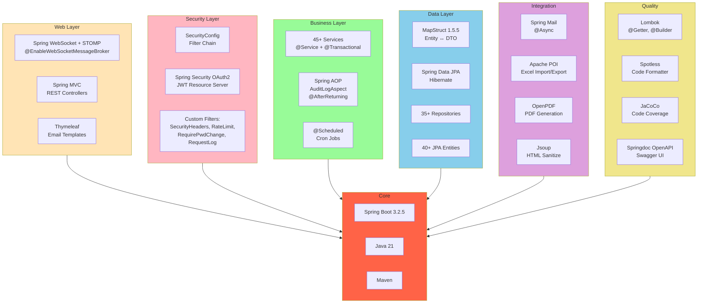

# System Architecture Diagrams - UEIMS (Mermaid)

Sơ đồ dạng Mermaid có thể render trên GitHub, Notion, hoặc các tool hỗ trợ Mermaid.

---

## 1. Sơ đồ tổng quan 3-tier

```mermaid
graph TB
    subgraph Users["Người dùng"]
        S[Sinh viên]
        E[Doanh nghiệp]
        TM[Training Manager]
        A[Admin]
    end

    subgraph Frontend["TẦNG 1: CLIENT TIER (React 18 + Vite + TypeScript)"]
        direction TB
        FE_Pages[Pages: Login, Dashboard, Student, Enterprise, TrainingMgr, Admin]
        FE_Layout[Layouts: ModernLayout, AppLayout]
        FE_Stops[Stores: useAuthStore, useNotificationStore]
        FE_Services[Services: 40+ API Services]
        FE_Axios[Axios + Interceptors<br/>Bearer JWT + Auto Refresh]
        FE_WS[WebSocket Client<br/>SockJS + STOMP]
        FE_RQ[TanStack Query v5]

        FE_Pages --> FE_Layout
        FE_Pages --> FE_Stops
        FE_Pages --> FE_Services
        FE_Services --> FE_Axios
        FE_Services --> FE_RQ
        FE_Stops --> FE_Axios
        FE_Pages --> FE_WS
    end

    subgraph Backend["TẦNG 2: APPLICATION TIER (Spring Boot 3.2.5 + Java 21)"]
        direction TB
        BE_Security[Security Filter Chain<br/>SecurityHeaders → RateLimit → JWT → PwdChange → ReqLog]
        BE_Controller[REST Controller Layer<br/>40+ Controllers]
        BE_Service[Service Layer<br/>45+ Services<br/>Business Logic + @Transactional]
        BE_Mapper[Mapper Layer<br/>MapStruct<br/>Entity ↔ DTO]
        BE_Repository[Repository Layer<br/>Spring Data JPA<br/>35+ Repositories]
        BE_Entity[Entity Layer<br/>40+ JPA Entities]

        BE_Aspect[AOP Aspect<br/>AuditLogAspect<br/>@AfterReturning on POST/PUT/DELETE]
        BE_Exception[GlobalExceptionHandler<br/>@ControllerAdvice<br/>ErrorCode enum 110+ mã]
        BE_DTO[DTO Layer<br/>Request/Response]
        BE_WS[WebSocket Config<br/>STOMP /ws<br/>JwtHandshakeInterceptor]
        BE_Cron[Scheduled Tasks<br/>ScanMissingReports<br/>TokenCleanup<br/>RequestLogCleanup]

        BE_Security --> BE_Controller
        BE_Controller --> BE_Service
        BE_Service --> BE_Mapper
        BE_Service --> BE_Repository
        BE_Repository --> BE_Entity
        BE_Mapper --> BE_DTO
        BE_Controller -.-> BE_Aspect
        BE_Service -.-> BE_Exception
        BE_Controller -.-> BE_WS
        BE_Service -.-> BE_Cron
    end

    subgraph External["TẦNG 3: EXTERNAL SERVICES & STORAGE"]
        DB[(PostgreSQL Database<br/>40+ tables)]
        SMTP[SMTP Mail Server<br/>Gmail/SendGrid]
        FS[File Storage<br/>CV, Avatar, Reports]
    end

    S --> Frontend
    E --> Frontend
    TM --> Frontend
    A --> Frontend

    FE_Axios -->|HTTPS + JWT| BE_Security
    FE_WS -->|WSS + JWT| BE_WS

    BE_Repository -->|JDBC| DB
    BE_Service -->|SMTP| SMTP
    BE_Service -->|File I/O| FS

    style Users fill:#FFE4B5
    style Frontend fill:#E0F2FE
    style Backend fill:#FEF3C7
    style External fill:#D1FAE5
```

---

## 2. Sơ đồ Backend chi tiết (Controller → Service → Mapper → Repository → Entity)

```mermaid
graph LR
    subgraph In["Request từ Frontend"]
        HTTP[HTTP Request + JWT]
    end

    subgraph FilterChain["Security Filter Chain"]
        F1[SecurityHeadersFilter]
        F2[RateLimitFilter]
        F3[BearerTokenAuthenticationFilter]
        F4[RequirePasswordChangeFilter]
        F5[RequestLoggingFilter]
    end

    HTTP --> F1 --> F2 --> F3 --> F4 --> F5

    subgraph Controller["REST CONTROLLER LAYER"]
        AC[AuthenticationController]
        AppC[ApplicationController]
        JPC[JobPostController]
        IC[InterviewController]
        URC[WeeklyReportController]
        EC[EnterpriseController]
        UC[UserController]
        Dots[...]
    end

    F5 --> Controller

    subgraph Service["SERVICE LAYER (Business Logic)"]
        AS[AuthenticationService]
        AppS[ApplicationService]
        JPS[JobPostService]
        IS[InterviewService]
        WRS[WeeklyReportService]
        ES[EnterpriseService]
        US[UserService]
        MS[MailService<br/>@Async]
        Cron[ScanMissingReportsService]
        Dots2[...]
    end

    Controller --> Service

    subgraph Mapper["MAPPER LAYER (MapStruct)"]
        AM[ApplicationMapper]
        JM[JobPostMapper]
        IM[InterviewMapper]
        WM[WeeklyReportMapper]
        UM[UserMapper]
        Dots3[...]
    end

    Service --> Mapper

    subgraph Repository["REPOSITORY LAYER (JPA)"]
        AR[ApplicationRepository]
        JR[JobPostRepository]
        IR[InterviewRepository]
        WR[WeeklyReportRepository]
        UR[UserRepository]
        Dots4[...]
    end

    Service --> Repository

    subgraph Entity["ENTITY LAYER (JPA)"]
        AE[Application]
        JE[JobPost]
        IE[Interview]
        WE[WeeklyReport]
        UE[User]
        Dots5[...]
    end

    Repository --> Entity

    subgraph CrossCutting["XUYÊN SUỐT (Cross-cutting)"]
        Aspect[AuditLogAspect<br/>AOP @AfterReturning]
        GEH[GlobalExceptionHandler<br/>@ControllerAdvice]
        WSC[WebSocketConfig<br/>STOMP]
    end

    Controller -.-> Aspect
    Service -.-> GEH
    Service -.-> MS
    Controller -.-> WSC

    Entity --> DB[(PostgreSQL)]
    MS --> SMTP[SMTP Server]
    Service -.-> Cron

    style FilterChain fill:#FECACA
    style Controller fill:#BFDBFE
    style Service fill:#FED7AA
    style Mapper fill:#FDE68A
    style Repository fill:#BBF7D0
    style Entity fill:#C7D2FE
    style CrossCutting fill:#FBCFE8
```

---

## 3. Sơ đồ Module Application (chi tiết)



---

## 4. Sơ đồ WebSocket Real-time



---

## 5. Sơ đồ Database (Entities chính)



---

## 6. Sơ đồ phân quyền theo Role



---

## 7. Sơ đồ Exception Handling Flow



---

## 8. Sơ đồ Cron Jobs

```mermaid
gantt
    title Scheduled Tasks (Cron Jobs)
    dateFormat HH:mm
    axisFormat %H:%M

    section Daily
    ScanMissingReports     :active, scan, 00:00, 1m
    InvalidatedTokenCleanup :token, 00:05, 1m
    RequestLogCleanup      :reqlog, 01:00, 5m

    section Weekly
    SemesterStatisticsUpdate :semester, 02:00, 10m
```



---

## 9. Sơ đồ Tech Stack (Frontend)



---

## 10. Sơ đồ Tech Stack (Backend)



---

## Cách sử dụng

Các sơ đồ trên có thể được render tại:
1. **GitHub** - Tự động render trong file `.md`
2. **Mermaid Live Editor** - https://mermaid.live
3. **VS Code** - Cài extension "Markdown Preview Mermaid Support"
4. **Notion** - Paste code vào block `/mermaid`

**Lưu ý:** Ký tự `&commat;` được escape để GitHub render đúng. Khi paste vào Mermaid Live Editor, hãy thay `&commat;` bằng `@`.